<!DOCTYPE html>
<html lang="en">
<head>
<meta charset="UTF-8">
<meta name="viewport" content="width=device-width, initial-scale=1" />
<title>Allan Binoy Issac Portfolio</title>

</head>

<body>

<h1>ALLAN BINOY ISSAC</h1>

<!-- About Me Section -->

  

    <h2 class="center_underline"><u>About me</u></h2>
    
I am currently a Robotics MSc student at The University of Manchester. My areas of expertise include embedded systems, control and robotics. My career goal is to become a robotics researcher.

    

      
      
    

  

  

    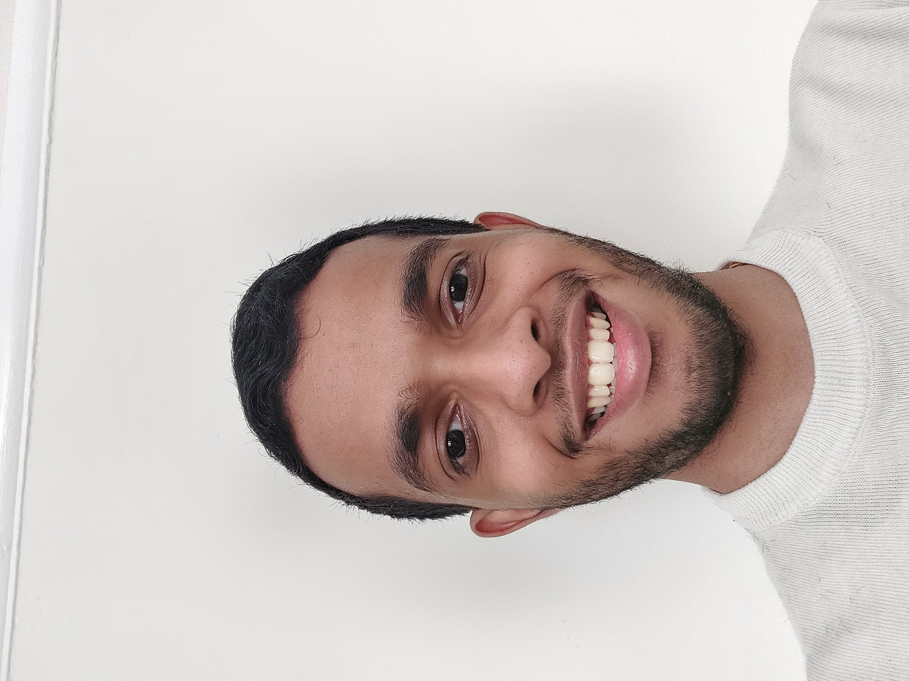
  

<!-- Projects Section -->

  <h2 class="center_underline"><u>Projects</u></h2>

  

    

      <h3>Autonomous robotic platform for object detection and retrieval</h3>
      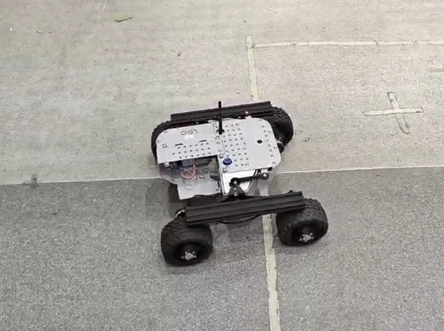
      
As part of the MSc team project, we are developing a robotic platform based on the Leo Rover to autonomously detect and navigate towards differently coloured objects...

    

    

      <h3>Biomedical Radar Device for Soft-tissue Imaging Research</h3>
      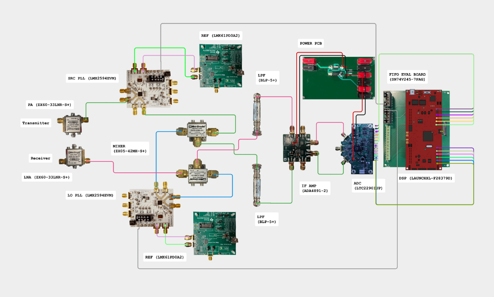
      
Developed a prototype near-field radar imaging system for non-invasive soft-tissue imaging...

    

    

      <h3>C.U.B.O. (Cube Utilising Brutal Over-engineering)</h3>
      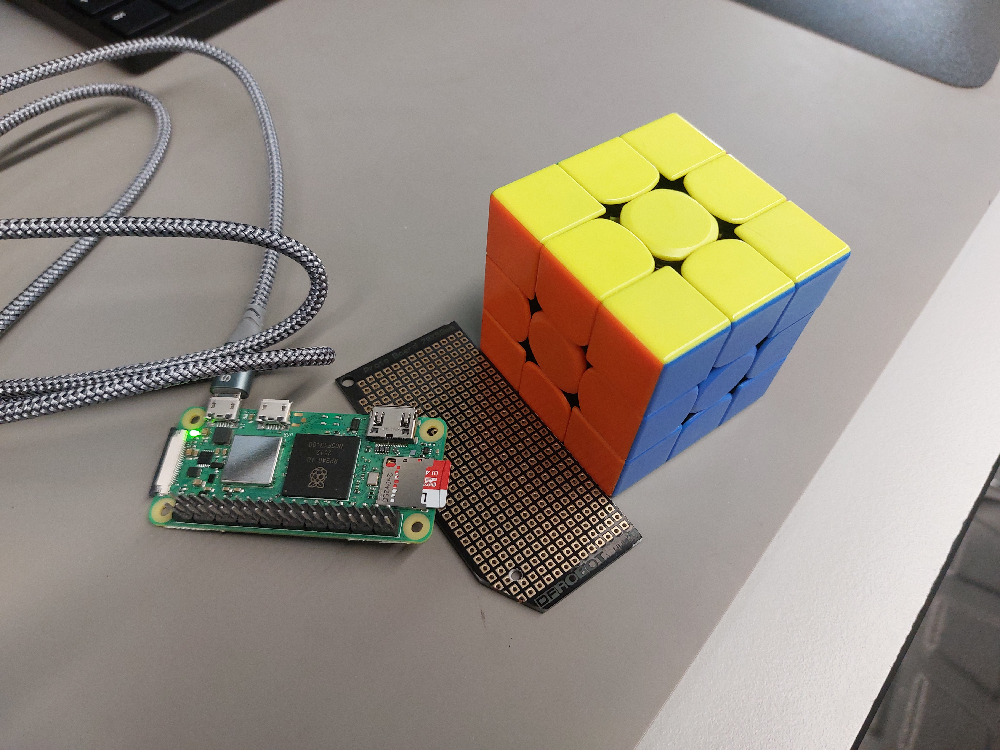
      
An ongoing RoboSoc project, this team project involves designing an autonomous mechatronic system to solve a 3x3 Rubik's cube under 60 seconds...

    

    

      <h3>DSP-based musical reverb algorithms using Blackfin devices</h3>
      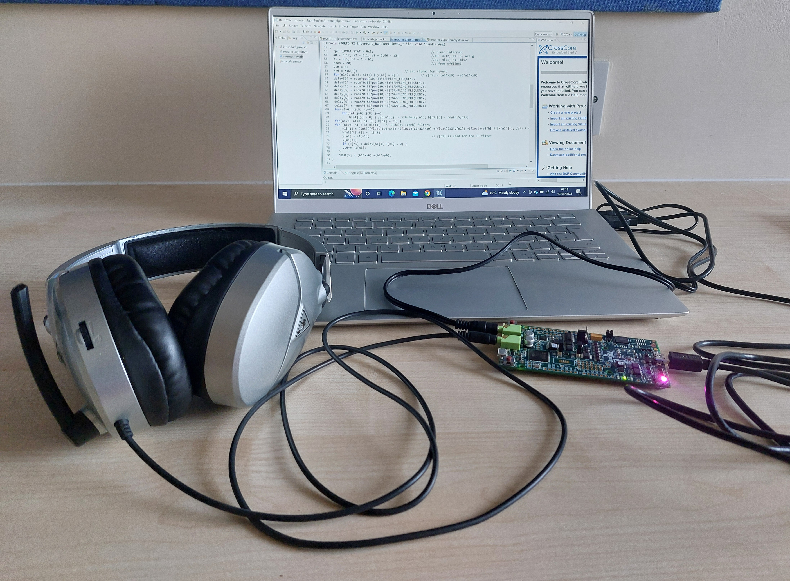
      
This is my third-year individual project which implemented a reverberation algorithm...

    

    

      <h3>Embedded Systems Project</h3>
      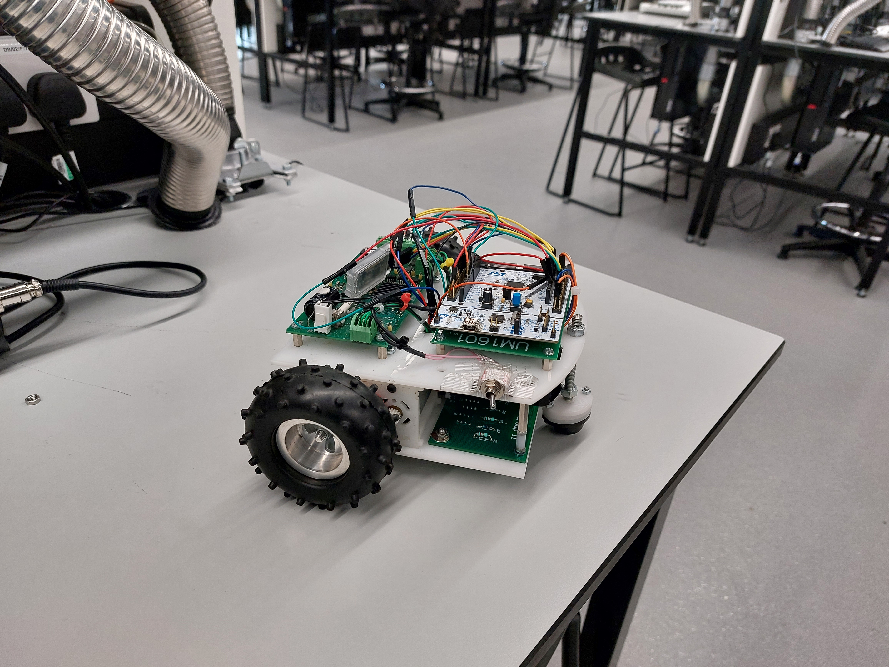
      
In this second-year team project, we designed a semi-autonomous buggy that could follow a white line...

    

  

<!-- Skills Section -->
<h2 class="center_heading"><u>Skills</u></h2>

  
  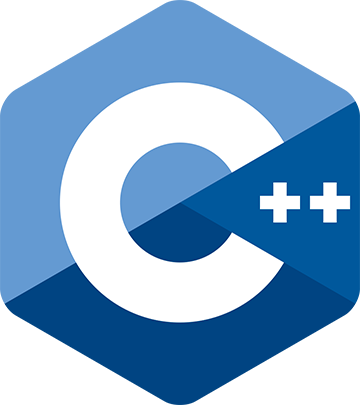
  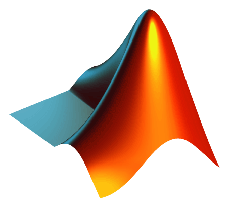
  
  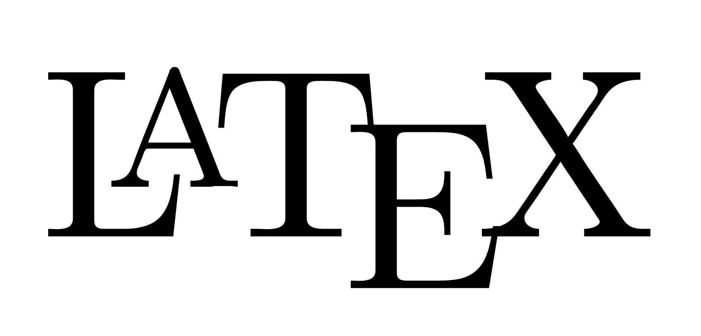
  
  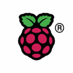
  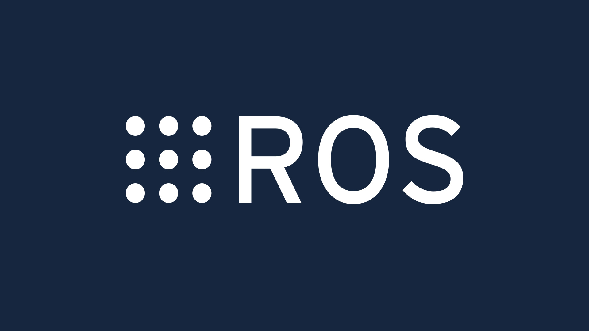

<!-- Academic Videos Section -->
<h2 class="center_heading"><u>Academic videos</u></h2>

  <iframe width="560" height="315" src="https://www.youtube.com/embed/rEPwbM8i3BM?si=GJhMsOeDzOkjb-d4&amp;start=1" 
  title="YouTube video player" frameborder="0" allow="accelerometer; autoplay; clipboard-write; encrypted-media; gyroscope; picture-in-picture; web-share" 
  referrerpolicy="strict-origin-when-cross-origin" allowfullscreen></iframe>

<!-- Footer -->
<footer>
  
<b>&copy; Allan Binoy Issac. All rights reserved.</b>

  <a href="mailto:allanbissac@outlook.com" style="color:white">allanbissac@outlook.com</a>
</footer>

</body>
</html>
