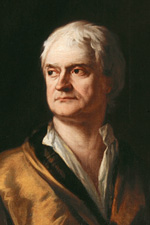
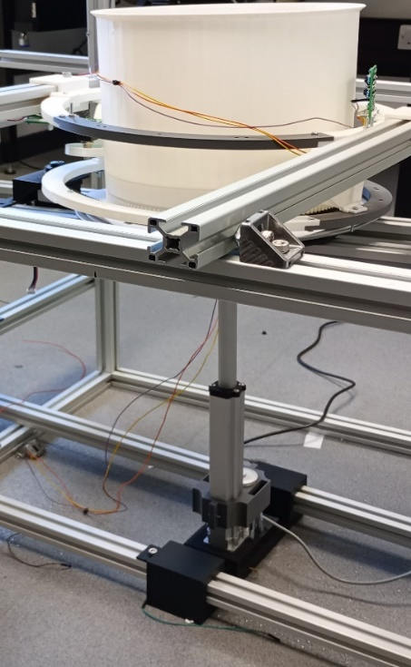

<html>
<head>
<meta name="viewport" content="width=device-width, initial-scale=1">
  
</head>
  
<body>
  <h1>ALLAN BINOY ISSAC</h1>
  

  

    

      <h2>About me</h2>
      
I am a Robotics MSc student at The University of Manchester. My areas of expertise include embedded systems, control and robotics.

    

    

    
      

    

  

  

    <h2>Projects</h2>
    <!-- 
<b>Autonomous robotic platform for object detection and retrieval</b>
 -->
    <h3><b>Autonomous robotic platform for object detection and retrieval</b></h3>
    
Currently developing a robotic platform based on the Leo Rover to autonomously detect and navigate towards differently coloured objects. The robot is expected to carry the object using a gripper attached to its manipulator and place the object in a bin that is of the same colour as the object.

    <h3>Biomedical Radar Device for Soft-tissue Imaging Research</h3>
    
    
Developed a prototype near-field radar imaging system for non-invasive soft-tissue imaging. Focused on writing firmware for a Texas Instruments LAUNCHXL-F28379D board and Arduino Uno board for phase-locked loop frequency generation and communication with a mechatronic rig, respectively.

    <h3>C.U.B.O. (Cube Utilising Brutal Over-engineering)</h3>
    
Designing a robotic system powered by a Raspberry Pi board to solve a 3x3 Rubik's cube under 1 minute. Features a mechanical holder for the Rubik's cube and computer vision algorithms to perform the pattern identification and action implementation.

    <h3>DSP-based musical reverb algorithms using Blackfin devices</h3>
    
Implemented a reverberation algorithm comprised of digital comb filters, low pass filters and allpass filters for offline and real-time audio. The offline algorithm was applied to audio files through a custom graphical user interface in Delphi. Real-time audio processing was achieved on an Analog Devices Evaluation board featuring an ADSPBF706 digital signal processor

    <h3>Embedded Systems Project</h3>
    
Designed a line-following buggy featuring an STM32 microcontroller board. Duties involved writing the PID control algorithm and TCRT5000 sensor array PCB design.

    
  

  
<h2 class="myDivWhite">Skills</h2>

  
  
  
  
  
  
  
  
  

<h2 class="myDivWhite">Video</h2>

<footer>
  <h4>&copy;Allan Binoy Issac. All rights reserved.</h4>
  <a href="mailto:allanbissac@outlook.com" style="color:white">allanbissac@outlook.com</a>
</footer>

</body>

</html>
